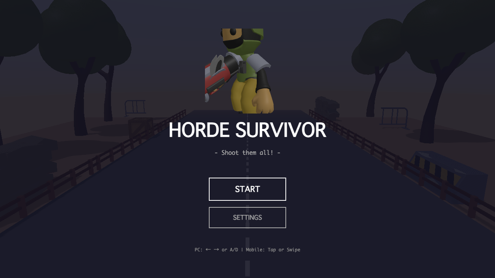
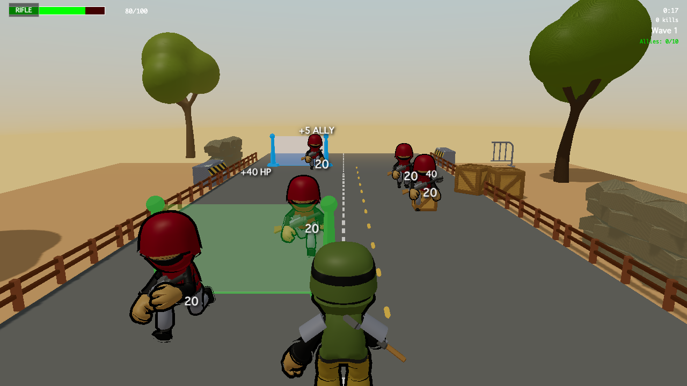

# HORDE SURVIVOR

縦スクロール型ホードサバイバル × オートシューティング。プレイヤーは画面下のラインを背に陣取り、上方から押し寄せる敵をオート射撃で迎撃しながら、流れてくる「武器樽」と「ゲート」で武装と仲間を強化して生き延びる。`Last War` 風のアイテム動線（樽を撃って取得 / ゲートを通過してバフ発動）を採用したブラウザ製ミニゲーム。





## 主な特徴 / 遊び方

- **オートシュート**: プレイヤーは移動のみ、武器は自動発射。武器ジャンルは RIFLE / SHOTGUN / MACHINEGUN の 3 種で、樽を撃破して取得した最新武器に切り替わる。
- **ゲート通過バフ**: `ALLY_ADD`（仲間追加）/ `ATTACK_UP` / `SPEED_UP` / `HEAL` をプレイヤー通過時に発動。仲間単独通過はスルー。
- **Wave 進行**: 45s / 90s / 180s の境目でボーナス樽（上位武器）と強化ゲート（効果量 +50%）を確定スポーン。
- **モバイル対応**: タッチ操作・縦画面前提のレイアウト。

## 技術スタック

- TypeScript 5 / ES Modules
- [Three.js](https://threejs.org/) 0.183（WebGL レンダラ + GLTFLoader）
- [Vite](https://vitejs.dev/) 5 — 開発サーバ / ビルド
- [Jest](https://jestjs.io/) 29 + ts-jest — ユニットテスト
- ESLint / size-limit / gltf-pipeline

## セットアップ

```bash
npm install
npm run dev          # http://localhost:5173 で開発サーバ起動
```

### スクリプト

| コマンド | 用途 |
|---|---|
| `npm run dev` | Vite 開発サーバ |
| `npm run build` | TypeScript 型チェック + 本番ビルド（`dist/`） |
| `npm run preview` | ビルド成果物のローカル配信 |
| `npm run lint` | ESLint（`src/` 配下） |
| `npm test` | Jest（`tests/`） |
| `npm run test:watch` | Jest watch モード |
| `npm run size` | size-limit でバンドルサイズ計測 |
| `npm run audit` | `npm audit --audit-level=high` |
| `npm run check` | lint → test → build → size をまとめて実行（CI 相当） |
