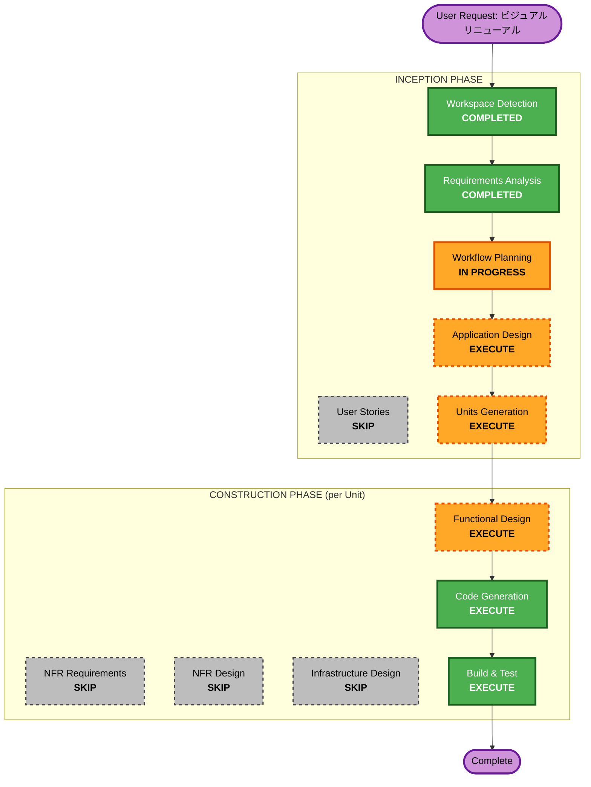

# Execution Plan - Iteration 3: ビジュアルリニューアル（Three.js導入）

## Detailed Analysis Summary

### Transformation Scope
- **Transformation Type**: Architectural（レンダリングエンジン全面移行）
- **Primary Changes**: Canvas 2D → Three.js WebGL、全UI HTMLオーバーレイ化
- **Related Components**: RenderSystem, EntityFactory, UI層, InputHandler, EffectSystem, WeaponSystem, CleanupSystem

### Change Impact Assessment
- **User-facing changes**: Yes — ビジュアル全面刷新（3Dパース、ライティング、カートゥン風キャラ）
- **Structural changes**: Yes — MeshComponent新設、RenderSystem全面書き直し、UI HTMLオーバーレイ化
- **Data model changes**: No — ECSコア、PositionComponent等は維持
- **API changes**: No — 外部APIなし
- **NFR impact**: Yes — パフォーマンス品質ティア、メモリ管理、セキュリティ、レスポンシブ対応

### Component Relationships
- **Primary Component**: RenderSystem（Three.jsレンダリング）
- **Supporting Components**: EntityFactory（3Dメッシュ生成）、EffectSystem（3Dエフェクト）
- **Adapter Components**: WeaponSystem（MeshComponentアダプター）
- **Maintenance Components**: CleanupSystem（dispose()追加）
- **UI Components**: HUD, TitleScreen, GameOverScreen（HTMLオーバーレイ化）
- **Unchanged Components**: CollisionSystem, MovementSystem, HealthSystem, WaveManager等（2D論理座標維持）

### Risk Assessment
- **Risk Level**: Medium
- **Rollback Complexity**: Moderate（RenderSystemのみ差し替えだが影響ファイル多い）
- **Testing Complexity**: Complex（ビジュアル品質のステークホルダー承認が必要）

## Phases to Execute

### INCEPTION PHASE
- [x] Workspace Detection - COMPLETED
- [x] Requirements Analysis - COMPLETED [AutoReviewed: PASS]
- [x] User Stories - SKIP
  - **Rationale**: ユーザー向け機能追加なし。技術的ビジュアル移行のため、ユーザーストーリーは不要
- [x] Workflow Planning - IN PROGRESS
- [ ] Application Design - **EXECUTE**
  - **Rationale**: MeshComponent新設、Three.jsシーン構成、座標系変換層、品質ティア切替、HTMLオーバーレイUI等の新規アーキテクチャ設計が必要
- [ ] Units Generation - **SKIP**
  - **Rationale**: 運用停止中のため1 Unitで一括実装。段階的移行不要。Unit分割なし

### CONSTRUCTION PHASE（各Unitで繰り返し）
- [ ] Functional Design - **EXECUTE**
  - **Rationale**: Three.jsシーン構築、プロシージャルメッシュ生成、座標変換等の複雑なロジック設計が必要
- [ ] NFR Requirements - **SKIP**
  - **Rationale**: NFR-01〜07が要件定義で包括的に定義済み（パフォーマンスティア、メモリ管理、セキュリティ、レスポンシブ対応）
- [ ] NFR Design - **SKIP**
  - **Rationale**: FD/CG段階でNFR要件を直接反映する
- [ ] Infrastructure Design - **SKIP**
  - **Rationale**: 静的ホスティング、Viteビルド。インフラ構成変更なし
- [ ] Code Generation - **EXECUTE**（常に実行）
- [ ] Build and Test - **EXECUTE**（常に実行）

### OPERATIONS PHASE
- [ ] Operations - PLACEHOLDER

## Workflow Visualization

## 実装方針

**1 Unitで一括実装**（運用停止中のため段階的移行不要）

- SpriteComponent → MeshComponent を一括置換
- WeaponSystem, AllyFollowSystem等のSpriteComponent依存箇所を直接修正
- アダプターパターン/後方互換性は不要
- 全面書き換え後にまとめてBuild & Test

## Success Criteria
- **Primary Goal**: 参考画像に近いリッチな3Dビジュアルへの全面移行
- **Key Deliverables**: Three.jsベースのゲーム描画、プロシージャル3Dキャラクター、パース道路背景、HTMLオーバーレイUI
- **Quality Gates**:
  - 自動レビューPASS（各FD/CG段階）
  - NFR-01パフォーマンス目標達成（High: 平均60fps、Low: 平均30fps）
  - NFR-04ビジュアル品質受入基準（ステークホルダー承認）
  - NFR-05メモリ管理目標達成（JSヒープ200MB以下）
  - 既存ゲームロジックの回帰テスト合格
