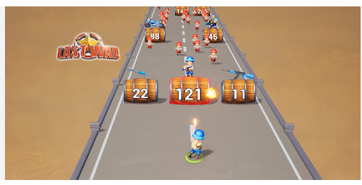

# Requirements - Iteration 3: ビジュアルリニューアル（Three.js導入）

## 参考画像

## Intent Analysis

- **User Request**: 参考画像のようなリッチな3Dビジュアルデザインへの全面改修
- **Request Type**: Migration（Canvas 2D → Three.js WebGL）+ Enhancement（ビジュアル品質向上）
- **Scope Estimate**: System-wide（レンダリング・UI・入力・エンティティ生成全体に影響）
- **Complexity Estimate**: Complex（レンダリングエンジン全面移行 + 3Dシーン構築）

## ユーザー決定事項

| 項目 | 決定 |
|---|---|
| レンダリングエンジン | Three.js（WebGL） |
| カメラアングル | 斜め上視点（参考画像と同じ3Dパースペクティブ） |
| キャラクター描画 | プロシージャル3Dメッシュ（Box/Sphere/Cylinder組み合わせ + ToonMaterial） |
| GLTF対応 | 後から差し替え可能な設計（抽象レイヤー設置） |
| 背景テーマ | 参考画像風（グレー道路 + ガードレール + 砂漠地形） |
| 障害物追加 | 今回は追加しない（ビジュアル改修のみ） |
| ゲームプレイ変更 | なし（既存ロジック維持） |

## 機能要件

### FR-01: Three.jsレンダリングエンジン導入

- Canvas 2D描画をThree.js WebGLレンダラーに全面移行
- PerspectiveCamera で斜め上からの見下ろしアングルを実現
- 既存のECSアーキテクチャは維持し、RenderSystemのみ差し替え
- GameServiceのゲームループにThree.jsのレンダリングを統合

### FR-02: 3D背景・地形

- 道路: グレーの平面メッシュ、白い車線マーキング
- ガードレール: 道路の両サイドに金属風のレール
- 砂漠地形: 道路の外側に砂色のテクスチャ地面
- スクロール感: 地面テクスチャのUVオフセットで前進感を演出

### FR-03: プロシージャル3Dキャラクター

- プレイヤー: Box/Sphere/Cylinderで構成したカートゥン風兵士
  - 胴体（Box）、頭（Sphere）、手足（Cylinder）、ヘルメット
  - MeshToonMaterial でセルシェーディング風
  - 武器タイプ別の武器モデル（簡易形状）
- 味方（Ally）: プレイヤーと類似形状、緑系カラーリング
- 敵（Enemy）: タイプ別に異なるカラー・サイズ
  - NORMAL: 赤系、標準サイズ
  - FAST: オレンジ系、小型
  - TANK: 紫系、大型
  - BOSS: 暗赤系、特大 + 装飾
- 全キャラクターはObject3Dベースで、将来GLTF差し替え可能な抽象化

### FR-04: HP/数値表示の3D演出

- 敵頭上にHP数値をSprite or CSS2DRendererで表示
- ダメージ時にフロートアップするダメージ数値表示
- ヒット時の白フラッシュ（マテリアルカラー一時変更）

### FR-05: エフェクト3D化

- マズルフラッシュ: PointLight + パーティクル
- 弾丸: 光る球体（emissive material）
- 敵撃破: パーティクルエフェクト（破片飛散）
- バフ取得: 光の柱エフェクト
- アイテムドロップ: 回転する3Dジェム

### FR-06: ライティング

- AmbientLight で基本照明
- DirectionalLight で太陽光（影付き）
- キャラクターやアイテムに自然な影を付与

### FR-07: UI移行

- HUD（HP、バフ、スコア等）: HTMLオーバーレイ or CSS2DRenderer
- タイトル画面: HTML/CSS オーバーレイ
- ゲームオーバー画面: HTML/CSS オーバーレイ
- 設定画面: 既存のHTML/CSSベースを維持
- モバイル操作ボタン: HTMLオーバーレイで3Dシーン上に配置

### FR-08: 入力座標変換

- タッチ/クリック座標をThree.jsの3D空間座標に変換（Raycasting）
- 既存のキーボード/スワイプ入力は座標系変換のみ

### FR-09: 座標系マッピング方針

- ゲームロジックは既存の2D論理座標系（720x1280px）を維持する
- RenderSystemが2D論理座標→3Dワールド座標への変換を一元的に担う
- マッピングルール: ゲーム座標X → ワールドX軸、ゲーム座標Y → ワールドZ軸（XZ平面）
- ワールドY軸は高さ（キャラクターの身長、ジャンプ等）に使用
- CollisionSystem, MovementSystem等のゲームロジック系Systemは2D論理座標のみを参照し、3Dワールド座標を直接操作しない
- InputHandlerはRaycastingで取得した3Dワールド座標を2D論理座標に逆変換してから各Systemに渡す

## 非機能要件

### NFR-01: パフォーマンス
- ターゲットデバイス最低スペック:
  - iOS: iPhone 12以降（A14 Bionic, 2020年〜）
  - Android: Snapdragon 7xx以降相当のGPU搭載端末（2020年〜）
  - デスクトップ: WebGL 2.0対応ブラウザ（Chrome 90+, Firefox 90+, Safari 15+, Edge 90+）
- パフォーマンス目標:
  - High品質（デスクトップ / ハイエンドモバイル）: 平均60fps、最低45fps
  - Low品質（最低スペック端末）: 平均30fps、最低24fps
  - 端末性能に応じてHigh/Lowを自動選択（手動切替も可）
- High品質: シャドウマップ有効、フルエフェクト
- Low品質: シャドウマップ無効、パーティクル数削減、ポストプロセス無効
- 同時表示エンティティ50体以上でも上記fps目標を維持
- InstancedMeshを活用し、同種エンティティのドローコールを最小化
- gzip後バンドルサイズ上限: 1MB以下（Three.js含む）
- 初期ロード時間目標: 3G回線で5秒以内、4G/Wi-Fiで2秒以内
- Three.jsはTree-shakingを適用し、使用モジュールのみをバンドルに含める
- WebGL非対応ブラウザでは「このブラウザはWebGLに対応していないため、ゲームをプレイできません」等のHTMLメッセージを表示

### NFR-02: アセット管理
- 外部テクスチャファイル不使用（プロシージャル生成 or コード内定義）
- 将来のGLTFモデル差し替えに対応する抽象インターフェース

### NFR-03: 互換性
- 既存のECS（World/Entity/Component/System）は維持
- ゲームロジック系System（Collision, Movement, Wave等）は変更最小限
- 既存の設定画面・サウンドシステムとの共存
- コンポーネント移行方針（運用停止中のため一括移行）:
  - SpriteComponentをMeshComponentに一括置換（Object3D参照を保持）
  - WeaponSystem, AllyFollowSystem等のSpriteComponent依存箇所は直接MeshComponentを参照するよう修正
  - アダプターパターンや段階的移行は不要（運用中でないため後方互換性不要）

### NFR-04: コード品質
- TypeScript型安全性の維持
- 既存のESLint設定への準拠
- テスト可能な設計（レンダリングとロジックの分離維持）
- ビジュアル品質受入基準:
  - 参考画像との目視比較チェックリスト（カメラアングル、カラーパレット、オブジェクト配置、ライティング雰囲気）によるレビュー
  - ビジュアル品質はステークホルダー（依頼者）によるスクリーンショット承認をもって受入とする

### NFR-05: メモリ管理
- エンティティ破棄時にGeometry, Material, Textureのdispose()を必須とする
- CleanupSystemでエンティティ削除時に関連する全Three.jsリソースのdispose()を実行
- メモリ使用量目標: ゲームプレイ中のJSヒープ使用量200MB以下
- 長時間プレイ（30分間）でのメモリ増加率: 10%以内
- WebGLコンテキストロスト時の復帰処理:
  - `webglcontextlost` イベントを検知し、ゲームを一時停止
  - `webglcontextrestored` イベントで自動復帰（シーン・マテリアル・テクスチャの再構築）
  - 復帰不可時はユーザーにリロード促進メッセージを表示
- モバイルGPUメモリ制限を考慮し、テクスチャ解像度・パーティクル数をLow品質で制限

### NFR-06: セキュリティ
- HTMLオーバーレイUI（FR-07）での動的HTML生成においてinnerHTML使用を禁止し、textContentまたはDOM APIによる要素構築を使用する
- ユーザー入力値をDOMに反映する場合は必ずサニタイズ処理を経由する
- Content Security Policy（CSP）互換性:
  - Three.jsのshaderコンパイルがunsafe-evalを必要とするか検証し、必要な場合は該当スクリプトのみにnonce-basedのCSP例外を適用
  - unsafe-inline回避のため、インラインスタイル/スクリプトは外部ファイル化を原則とする

### NFR-07: レスポンシブ対応
- ウィンドウリサイズ時にThree.jsレンダラーサイズとカメラアスペクト比を自動更新
- 基準アスペクト比は9:16（720x1280）とし、異なるアスペクト比ではレターボックス表示で対応
- 画面回転（モバイル）時はリサイズイベントとして処理し、シーンを再描画
- HTMLオーバーレイUIもビューポートサイズに追従

## 影響範囲分析

### 大幅変更が必要なファイル
- `src/systems/RenderSystem.ts` → Three.js RenderSystemに全面書き直し
- `src/factories/EntityFactory.ts` → 3Dメッシュ生成に変更
- `src/components/SpriteComponent.ts` → MeshComponent新設に伴い段階的移行
- `src/game/GameService.ts` → Three.js初期化・レンダリング統合
- `src/input/InputHandler.ts` → 3D座標変換対応（Raycasting + 逆変換）
- `src/ui/HUD.ts` → HTMLオーバーレイ方式に変更
- `src/ui/TitleScreen.ts` → HTMLオーバーレイ方式に変更
- `src/ui/GameOverScreen.ts` → HTMLオーバーレイ方式に変更
- `index.html` → Three.jsレンダラー用DOM構造

### 中程度の変更
- `src/systems/EffectSystem.ts` → 3Dエフェクト（パーティクル・PointLight等）対応
- `src/systems/WeaponSystem.ts` → SpriteComponent.widthからMeshComponentバウンディングボックスへの銃口位置算出方式変更
- `src/systems/CleanupSystem.ts` → エンティティ破棄時のThree.jsリソースdispose()追加
- `src/systems/InputSystem.ts` → 3D座標変換との連携
- `src/config/gameConfig.ts` → 3D空間用パラメータ・品質設定追加

### 軽微な変更
- `src/systems/PlayerMovementSystem.ts` → 座標系は2D維持だが、InputHandler変更に伴う入力値の受け取り調整
- `src/systems/ItemCollectionSystem.ts` → 3Dエフェクト（回転ジェム等）のトリガー連携

### 変更なし（維持）
- `src/ecs/` → ECSコア全般
- `src/systems/CollisionSystem.ts` → 2D論理座標ベースのゲームロジック（変更不要）
- `src/systems/MovementSystem.ts` → 2D論理座標ベースのゲームロジック（変更不要）
- `src/systems/HealthSystem.ts` → ゲームロジック（変更不要）
- `src/systems/BuffSystem.ts` → ゲームロジック（変更不要）
- `src/systems/DefenseLineSystem.ts` → ゲームロジック（変更不要）
- `src/systems/AllyConversionSystem.ts` → ゲームロジック（変更不要）
- `src/systems/AllyFireRateSystem.ts` → ゲームロジック（変更不要）
- `src/systems/AllyFollowSystem.ts` → ゲームロジック（変更不要）
- `src/managers/WaveManager.ts` → ゲームロジック
- `src/managers/SpawnManager.ts` → ゲームロジック
- `src/audio/` → サウンドシステム全般
- `src/game/SettingsManager.ts` → 設定管理
